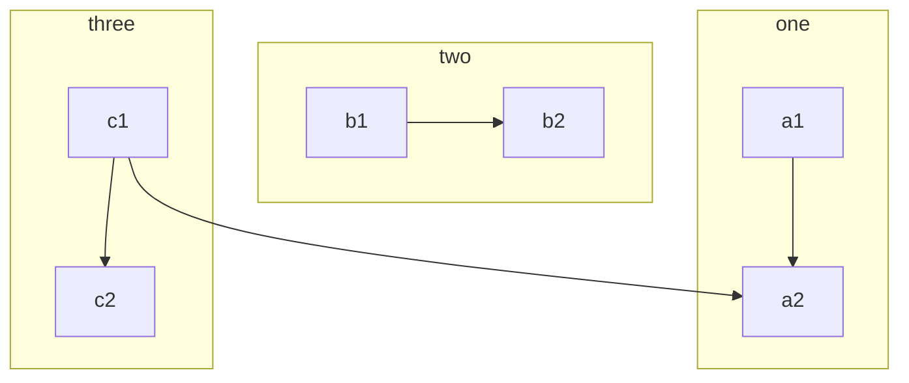
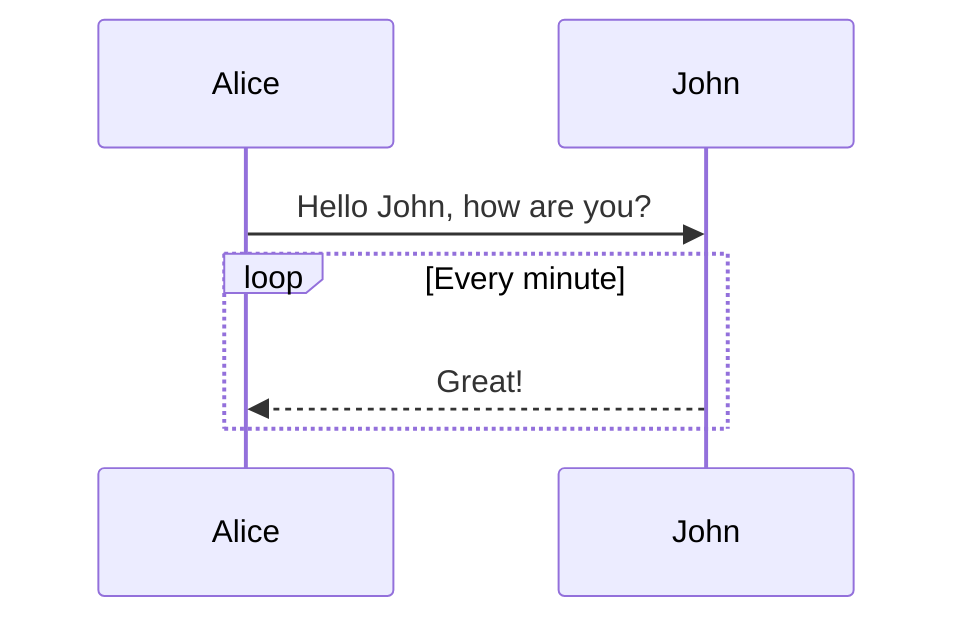
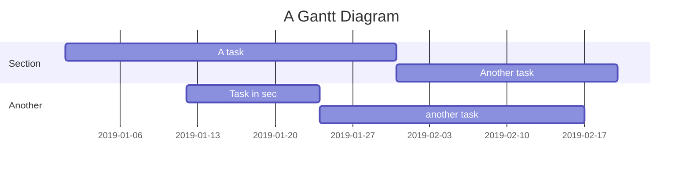
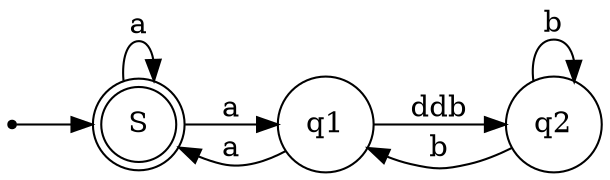

## 寄语与示例

本人`lotoze[骆驼泽]`，比较喜欢骆驼，它很有耐力=坚持，个人感觉坚持是现在大环境下最可贵的品质！

个人网站：https://lotoze.github.io/

永远学习，永远坚持，永远热爱~

奕澄名字取自我儿子和闺女（哈哈，还没出世）的名字最后一个字~

感谢我妻子和孩子的陪伴与支持，我永远爱他们！

愿奕澄与您同行~


奕澄Markdown 是一款**所见即所得**编辑器，支持 *Markdown*。

* 不熟悉 Markdown 可使用工具栏或快捷键进行排版
* 熟悉 Markdown 可直接排版，也可切换为分屏预览

这是一篇讲解如何正确使用 **Markdown** 的排版示例，学会这个很有必要，能让你的文章有更佳清晰的排版。


## 语法指导

### 普通内容

这段内容展示了在内容里面一些排版格式，比如：

- **加粗** - `**加粗**`
- *倾斜* - `*倾斜*`
- ~~删除线~~ - `~~删除线~~`
- `Code 标记` - `` `Code 标记` ``
- [超级链接](https://ld246.com) - `[超级链接](https://lotoze.github.io)`
- [username@gmail.com](mailto:username@gmail.com) - `[username@gmail.com](mailto:username@gmail.com)`

### 表情符号 Emoji

支持大部分标准的表情符号，可使用输入法直接输入，也可手动输入字符格式。通过输入 `:` 触发自动完成，可在个人设置中[设置常用表情]。

#### 一些表情例子

😄 😆 😵 😭 😰 😅  😢 😤 😍 😌
👍 👎 💯 👏 🔔 🎁 ❓ 💣 ❤️ ☕️ 🌀 🙇 💋 🙏 💢

### 标题

你可以选择使用 H1 至 H6，使用 ##(N) 打头。建议帖子或回帖中的顶级标题使用 Heading 3，不要使用 1 或 2，因为 1 是系统站点级，2 是帖子标题级。

> NOTE: 别忘了 # 后面需要有空格！

#### Heading 4

##### Heading 5

###### Heading 6

### 图片

> 注意：上传图片会自动引入，相对路径优先！


```


```

支持复制粘贴直接上传。

### 代码块

#### 普通

```
*emphasize*    **strong**
_emphasize_    __strong__
var a = 1
```

#### 语法高亮支持

如果在 ``` 后面跟随语言名称，可以有语法高亮的效果哦，比如:

##### 演示 Go 代码高亮

```go
package main

import "fmt"

func main() {
	fmt.Println("Hello, 世界")
}
```

##### 演示 Java 高亮

```java
public class HelloWorld {

    public static void main(String[] args) {
        System.out.println("Hello World!");
    }

}
```

> Tip: 语言名称支持下面这些: `ruby`, `python`, `js`, `html`, `erb`, `css`, `coffee`, `bash`, `json`, `yml`, `xml` ...

### 有序、无序、任务列表

#### 无序列表

- Java
  - Spring
    - IoC
    - AOP
- Go
  - gofmt
  - Wide
- Node.js
  - Koa
  - Express

#### 有序列表

1. Node.js
   1. Express
   2. Koa
   3. Sails
2. Go
   1. gofmt
   2. Wide
3. Java
   1. Latke
   2. IDEA

#### 任务列表

- [X] 发布 Sym
- [X] 发布 Solo
- [ ] 预约牙医

### 表格

如果需要展示数据什么的，可以选择使用表格。

| header 1 | header 2 |
| -------- | -------- |
| cell 1   | cell 2   |
| cell 3   | cell 4   |
| cell 5   | cell 6   |

### 隐藏细节

<details>
<summary>这里是摘要部分。</summary>
这里是细节部分。
</details>

### 段落

空行可以将内容进行分段，便于阅读。（这是第一段）

使用空行在 Markdown 排版中相当重要。（这是第二段）

### 链接引用

[链接文本][链接标识]

[链接标识]: lotoze.github.io
```
[链接文本][链接标识]

[链接标识]: https://lotoze.github.io
```

### 数学公式

多行公式块：

$$
\frac{1}{
  \Bigl(\sqrt{\phi \sqrt{5}}-\phi\Bigr) e^{
  \frac25 \pi}} = 1+\frac{e^{-2\pi}} {1+\frac{e^{-4\pi}} {
    1+\frac{e^{-6\pi}}
    {1+\frac{e^{-8\pi}}{1+\cdots}}
  }
}
$$

行内公式：

公式 $a^2 + b^2 = \color{red}c^2$ 是行内。

### 脑图

```mindmap
- 教程
- 语法指导
  - 普通内容
  - 提及用户
  - 表情符号 Emoji
    - 一些表情例子
  - 大标题 - Heading 3
    - Heading 4
      - Heading 5
        - Heading 6
  - 图片
  - 代码块
    - 普通
    - 语法高亮支持
      - 演示 Go 代码高亮
      - 演示 Java 高亮
  - 有序、无序、任务列表
    - 无序列表
    - 有序列表
    - 任务列表
  - 表格
  - 隐藏细节
  - 段落
  - 链接引用
  - 数学公式
  - 脑图
  - 流程图
  - 时序图
  - 甘特图
  - 图表
  - 五线谱
  - Graphviz
  - 多媒体
  - 脚注
- 快捷键
```

### 流程图



### 时序图



### 甘特图



### 图表

```echarts
{
  "title": { "text": "最近 30 天" },
  "tooltip": { "trigger": "axis", "axisPointer": { "lineStyle": { "width": 0 } } },
  "legend": { "data": ["帖子", "用户", "回帖"] },
  "xAxis": [{
      "type": "category",
      "boundaryGap": false,
      "data": ["2019-05-08","2019-05-09","2019-05-10","2019-05-11","2019-05-12","2019-05-13","2019-05-14","2019-05-15","2019-05-16","2019-05-17","2019-05-18","2019-05-19","2019-05-20","2019-05-21","2019-05-22","2019-05-23","2019-05-24","2019-05-25","2019-05-26","2019-05-27","2019-05-28","2019-05-29","2019-05-30","2019-05-31","2019-06-01","2019-06-02","2019-06-03","2019-06-04","2019-06-05","2019-06-06","2019-06-07"],
      "axisTick": { "show": false },
      "axisLine": { "show": false }
  }],
  "yAxis": [{ "type": "value", "axisTick": { "show": false }, "axisLine": { "show": false }, "splitLine": { "lineStyle": { "color": "rgba(0, 0, 0, .38)", "type": "dashed" } } }],
  "series": [
    {
      "name": "帖子", "type": "line", "smooth": true, "itemStyle": { "color": "#d23f31" }, "areaStyle": { "normal": {} }, "z": 3,
      "data": ["18","14","22","9","7","18","10","12","13","16","6","9","15","15","12","15","8","14","9","10","29","22","14","22","9","10","15","9","9","15","0"]
    },
    {
      "name": "用户", "type": "line", "smooth": true, "itemStyle": { "color": "#f1e05a" }, "areaStyle": { "normal": {} }, "z": 2,
      "data": ["31","33","30","23","16","29","23","37","41","29","16","13","39","23","38","136","89","35","22","50","57","47","36","59","14","23","46","44","51","43","0"]
    },
    {
      "name": "回帖", "type": "line", "smooth": true, "itemStyle": { "color": "#4285f4" }, "areaStyle": { "normal": {} }, "z": 1,
      "data": ["35","42","73","15","43","58","55","35","46","87","36","15","44","76","130","73","50","20","21","54","48","73","60","89","26","27","70","63","55","37","0"]
    }
  ]
}
```

### 五线谱

```abc
X: 24
T: Clouds Thicken
C: Paul Rosen
S: Copyright 2005, Paul Rosen
M: 6/8
L: 1/8
Q: 3/8=116
R: Creepy Jig
K: Em
|:"Em"EEE E2G|"C7"_B2A G2F|"Em"EEE E2G|\
"C7"_B2A "B7"=B3|"Em"EEE E2G|
"C7"_B2A G2F|"Em"GFE "D (Bm7)"F2D|\
1"Em"E3-E3:|2"Em"E3-E2B|:"Em"e2e gfe|
"G"g2ab3|"Em"gfeg2e|"D"fedB2A|"Em"e2e gfe|\
"G"g2ab3|"Em"gfe"D"f2d|"Em"e3-e3:|
```

### Graphviz



### Flowchart

```flowchart
st=>start: Start
op=>operation: Your Operation
cond=>condition: Yes or No?
e=>end

st->op->cond
cond(yes)->e
cond(no)->op
```

### 多媒体

支持 v.qq.com，youtube.com，youku.com，coub.com，facebook.com/video，dailymotion.com，.mp4，.m4v，.ogg，.ogv，.webm，.mp3，.wav 链接解析

https://www.bilibili.com/video/BV1ss4y127gi?spm_id_from=333.788.videopod.sections

### 脚注

这里是一个脚注引用[^1]，这里是另一个脚注引用[^bignote]。

[^1]: 第一个脚注定义。

[^bignote]: 脚注定义可使用多段内容。

       缩进对齐的段落包含在这个脚注定义内。
    
       ```
       可以使用代码块。
       ```
       还有其他行级排版语法，比如**加粗**和[链接](https://lotoze.github.io)。

```
这里是一个脚注引用[^1]，这里是另一个脚注引用[^bignote]。
[^1]: 第一个脚注定义。
[^bignote]: 脚注定义可使用多段内容。

    缩进对齐的段落包含在这个脚注定义内。

```
    可以使用代码块。
    ```
    **加粗**
    [链接](https://lotoze.github.io)

## 快捷键

| 名称           | 快捷键               | 备注              |
| -------------- | -------------------- | ----------------- |
| 表情           | :/⌘ E                |                   |
| 标题           | Ctrl H / ⌘ H         | 参见下文          |
| 粗体           | Ctrl B / ⌘ B         |                   |
| 斜体           | Ctrl I / ⌘ I         |                   |
| 删除线         | Ctrl S / ⌘ S         |                   |
| 链接           | Ctrl K / ⌘ K         | 参见下文          |
| 无序列表       | Ctrl L / ⌘ L         | 参见下文          |
| 有序列表       | Ctrl O / ⌘ O         | 参见下文          |
| 任务列表       | Ctrl J / ⌘ J         | 参见下文          |
| 引用           | Ctrl ; / ⌘ ;         | 参见下文          |
| 分割线         | Ctrl Shift H / ⌘ ⇧ H |                   |
| 代码块         | Ctrl U / ⌘ U         | 参见下文          |
| 代码           | Ctrl G / ⌘ G         |                   |
| 元素前插入空块 | Ctrl Shift B / ⌘ ⇧ B | wysiwyg & ir 模式 |
| 元素后插入空块 | Ctrl Shift E / ⌘ ⇧ E | wysiwyg & ir 模式 |
| 表格           | Ctrl M / ⌘ M         | 参见下文          |
| 撤销           | Ctrl Z / ⌘ Z         |                   |
| 重做           | Ctrl Y / ⌘ Y         |                   |
| 隐藏编辑器     | Ctrl P / ⌘ P         | sv 模式           |
| 全屏           | Ctrl ' / ⌘ '         |                   |
| 向上移动块元素 | Ctrl Shift U / ⌘ ⇧ U | wysiwyg & ir 模式 |
| 向下移动块元素 | Ctrl Shift D / ⌘ ⇧ D | wysiwyg & ir 模式 |
| 移除当前元素   | Ctrl Shift X / ⌘ ⇧ X | wysiwyg 模式      |
| At 用户        | @                    |                   |
| 错误输入       | Backspace            |                   |

### 标题 Ctrl H / ⌘ H

| 名称     | 快捷键                                 |
| -------- | -------------------------------------- |
| 变大     | Ctrl + / ⌘ +                           |
| 变小     | Ctrl - / ⌘ -                           |
| H1-H6    | Ctrl Alt 1/2/3/4/5/6 / ⌘ ⌥ 1/2/3/4/5/6 |
| 弹出菜单 | Ctrl H / ⌘ H                           |

### 链接 Ctrl K / ⌘ K

| 名称                 | 快捷键              |
| -------------------- | ------------------- |
| 输入框和元素之间切换 | Alt Enter / ⌥ Enter |
| 输入框之间切换       | Tab                 |

### 列表 Ctrl L/O/J / ⌘ L/O/J

| 名称               | 快捷键                                       | 备注                                                  |
| ------------------ | -------------------------------------------- | ----------------------------------------------------- |
| 缩进               | Tab Ctrl Shift I / ⌘ ⇧ I                     | Tab: 光标需位于开头                                   |
| 反向缩进           | Shift Tab / ⇧ Tab Ctrl Shift O / ⌘ ⇧ O Enter | Shift Tab / ⇧ Tab: 光标需位于开头 Enter: 需为空列表项 |
| 完成和待办之间切换 | Ctrl Shift J / ⌘ ⇧ J                         | 任务列表                                              |

### 引用 Ctrl ; / ⌘ ;

| 名称                 | 快捷键                     | 备注                                                       |
| -------------------- | -------------------------- | ---------------------------------------------------------- |
| 在顶层引用前插入空块 | Ctrl Alt Enter / ⌘ ⌥ Enter | wysiwyg 模式                                               |
| 在顶层引用后插入空块 | Alt Enter / ⌥ Enter        | wysiwyg 模式                                               |
| 插入块元素           | Ctrl Shift : / ⌘ ⇧ : >     | Ctrl Shift : / ⌘ ⇧ :: 块元素变为引用 >: 内联元素中插入引用 |
| 引用和块元素之间切换 | Ctrl ; / ⌘ ;               |                                                            |

### 代码块 Ctrl U / ⌘ U

| 名称                   | 快捷键              |
| ---------------------- | ------------------- |
| 输入框和代码块之间切换 | Alt Enter / ⌥ Enter |
| 隐藏编辑界面           | Escape              |
| 选中所有代码           | Ctrl A / ⌘ A        |

### 表格 Ctrl M / ⌘ M

| 名称                   | 快捷键                      |
| ---------------------- | --------------------------- |
| 在上方插入一行         | Ctrl + / ⌘ ⇧ F              |
| 在下方插入一行         | Ctrl + / ⌘ +                |
| 删除行                 | Ctrl - / ⌘ -                |
| 在左边插入一列         | Ctrl Shift + / ⌘ ⇧ G        |
| 在右边插入一列         | Ctrl Shift + / ⌘ ⇧ +        |
| 删除列                 | Ctrl Shift - / ⌘ ⇧ -        |
| 左对齐                 | Ctrl Shift L / ⌘ ⇧ L        |
| 中对齐                 | Ctrl Shift C / ⌘ ⇧ C        |
| 右对齐                 | Ctrl Shift R / ⌘ ⇧ R        |
| 光标移动到输入框中     | Alt Enter / ⌥ Enter         |
| 输入框之间切换         | Tab                         |
| 将光标移动到上一个元素 | Shift Tab / ⇧ Tab Backspace |
| 将光标移动到下一个元素 | Tab                         |

## English

### Summary

| Name                   | Keymap               | Remarks           |
| ---------------------- | -------------------- | ----------------- |
| Emoji                  | :/⌘ E                |                   |
| Headings               | Ctrl H / ⌘ H         | see below         |
| Bold                   | Ctrl B / ⌘ B         |                   |
| Italic                 | Ctrl I / ⌘ I         |                   |
| Strikeout              | Ctrl S / ⌘ S         |                   |
| Link                   | Ctrl K / ⌘ K         | see below         |
| Unordered List         | Ctrl L / ⌘ L         | see below         |
| Ordered List           | Ctrl O / ⌘ O         | see below         |
| Task List              | Ctrl J / ⌘ J         | see below         |
| Blockquote             | Ctrl ; / ⌘ ;         | see below         |
| Horizontal             | Ctrl Shift H / ⌘ ⇧ H |                   |
| Code Block             | Ctrl U / ⌘ U         | see below         |
| Inline Code            | Ctrl G / ⌘ G         |                   |
| Insert Block to Before | Ctrl Shift B / ⌘ ⇧ B | wysiwyg & ir mode |
| Insert Block to End    | Ctrl Shift E / ⌘ ⇧ E | wysiwyg & ir mode |
| Table                  | Ctrl M / ⌘ M         | see below         |
| Undo                   | Ctrl Z / ⌘ Z         |                   |
| Redo                   | Ctrl Y / ⌘ Y         |                   |
| Hide Edit              | Ctrl P / ⌘ P         | sv mode           |
| Fullscreen             | Ctrl ' / ⌘ '         |                   |
| Move Block to Up       | Ctrl Shift U / ⌘ ⇧ U | wysiwyg & ir mode |
| Move Block to Down     | Ctrl Shift D / ⌘ ⇧ D | wysiwyg & ir mode |
| Remove                 | Ctrl Shift X / ⌘ ⇧ X | wysiwyg mode      |
| At User                | @                    |                   |
| Mistyped               | Backspace            |                   |

### Headings Ctrl H / ⌘ H

| Name    | Keymap                                 |
| ------- | -------------------------------------- |
| Bigger  | Ctrl + / ⌘ +                           |
| Smaller | Ctrl - / ⌘ -                           |
| H1-H6   | Ctrl Alt 1/2/3/4/5/6 / ⌘ ⌥ 1/2/3/4/5/6 |
| Menu    | Ctrl H / ⌘ H                           |

### Link Ctrl K / ⌘ K

| Name                  | Keymap              |
| --------------------- | ------------------- |
| Toggle Input and Link | Alt Enter / ⌥ Enter |
| Toggle Input          | Tab                 |

### List Ctrl L/O/J / ⌘ L/O/J

| Name         | Keymap                                       | Remarks                                               |
| ------------ | -------------------------------------------- | ----------------------------------------------------- |
| Indent       | Tab Ctrl Shift I / ⌘ ⇧ I                     | Tab: Caret must be at Zero                            |
| Unindent     | Shift Tab / ⇧ Tab Ctrl Shift O / ⌘ ⇧ O Enter | Shift Tab / ⇧ Tab: Caret must be at Zero Enter: Empty |
| Toggle Check | Ctrl Shift J / ⌘ ⇧ J                         | Task List                                             |

### Blockquote Ctrl ; / ⌘ ;

| Name                    | Keymap                     | Remarks                                               |
| ----------------------- | -------------------------- | ----------------------------------------------------- |
| Move Caret to Top Start | Ctrl Alt Enter / ⌘ ⌥ Enter | wysiwyg mode                                          |
| Move Caret to Top End   | Alt Enter / ⌥ Enter        | wysiwyg mode                                          |
| Insert Blockquote       | Ctrl Shift : / ⌘ ⇧ : >     | Ctrl Shift : / ⌘ ⇧ :: Block Element >: Inline Element |
| Toggle Blockquote       | Ctrl ; / ⌘ ;               |                                                       |

### Code Block Ctrl U / ⌘ U

| Name                        | Keymap              |
| --------------------------- | ------------------- |
| Toggle Input and Code Block | Alt Enter / ⌥ Enter |
| Hide Edit                   | Escape              |
| Select all Code Block       | Ctrl A / ⌘ A        |

### Table Ctrl M / ⌘ M

| Name                        | Keymap                      |
| --------------------------- | --------------------------- |
| Insert 1 above              | Ctrl + / ⌘ ⇧ F              |
| Insert 1 below              | Ctrl + / ⌘ +                |
| Delete Row                  | Ctrl - / ⌘ -                |
| Insert 1 left               | Ctrl Shift + / ⌘ ⇧ G        |
| Insert 1 right              | Ctrl Shift + / ⌘ ⇧ +        |
| Delete Column               | Ctrl Shift - / ⌘ ⇧ -        |
| Left Alignment              | Ctrl Shift L / ⌘ ⇧ L        |
| Center Alignment            | Ctrl Shift C / ⌘ ⇧ C        |
| Right Alignment             | Ctrl Shift R / ⌘ ⇧ R        |
| Move Caret to Input         | Alt Enter / ⌥ Enter         |
| Toggle Input                | Tab                         |
| Move Caret to Previous Cell | Shift Tab / ⇧ Tab Backspace |
| Move Caret to Next Cell     | Tab                         |